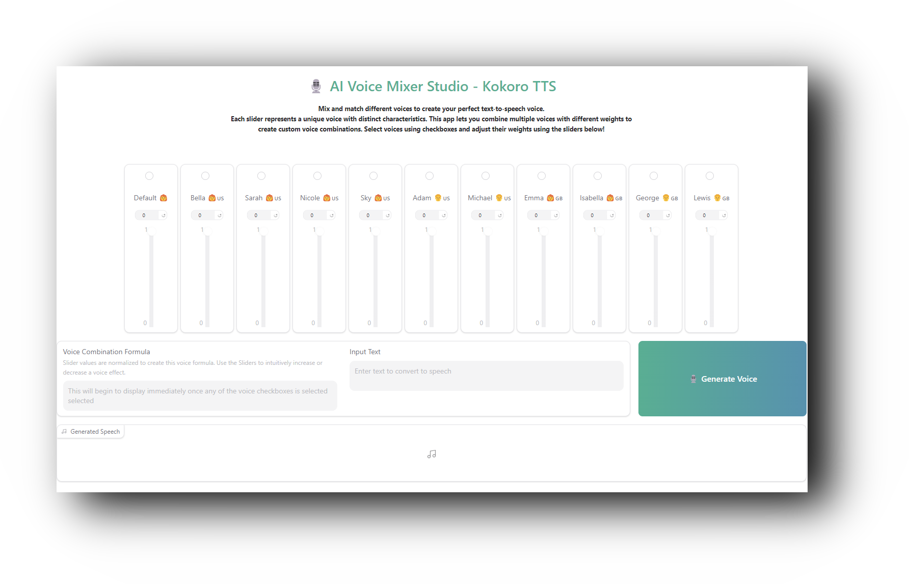

# **KokoroTTS-Mixer**
Mix and match different Kokoro voices to create your perfect text-to-speech voice. Intuitive UI that lets you combine multiple voices with different weights to create custom voice combinations.



## Setup

1. Clone this repository:
```bash
git clone https://github.com/[your-username]/kokorotts-mixer.git
cd kokorotts-mixer
```

2. Download required model files:
   - Download `kokoro-v0_19.onnx` and `kokoro-v0_19.pth` from [Hugging Face Space](https://huggingface.co/spaces/ysharma/Make_Custom_Voices_With_KokoroTTS/tree/main)
   - Place these files in the root directory of the project

3. Install dependencies:
```bash
pip install -r requirements.txt
```

## Project Structure
```
kokorotts-mixer/
├── app.py              # Gradio application
├── config.json         # Configuration settings
├── models.py           # Model definitions
├── kokoro.py          # Core KokoroTTS functionality
├── istftnet.py        # Audio processing
├── plbert.py          # ALBERT processing
└── [model files]      # Download separately
```

## Running the Application
```bash
python app.py
```

## Models
The following model files are required but not included in this repository due to size:
- `kokoro-v0_19.onnx` (346MB)
- `kokoro-v0_19.pth` (327MB)

Download these files from the original [Hugging Face Space](https://huggingface.co/spaces/ysharma/Make_Custom_Voices_With_KokoroTTS/tree/main).

